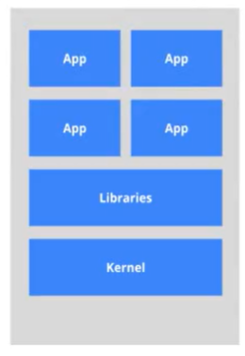
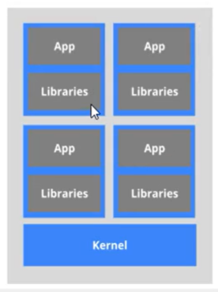
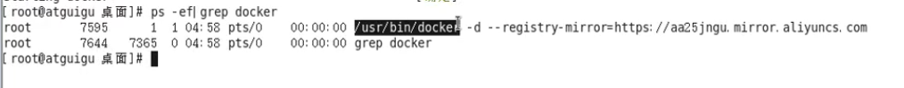
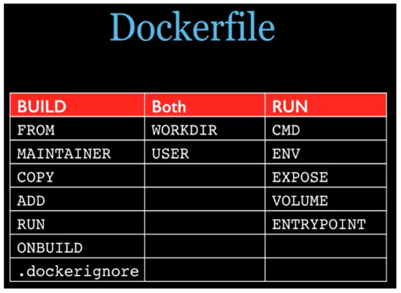
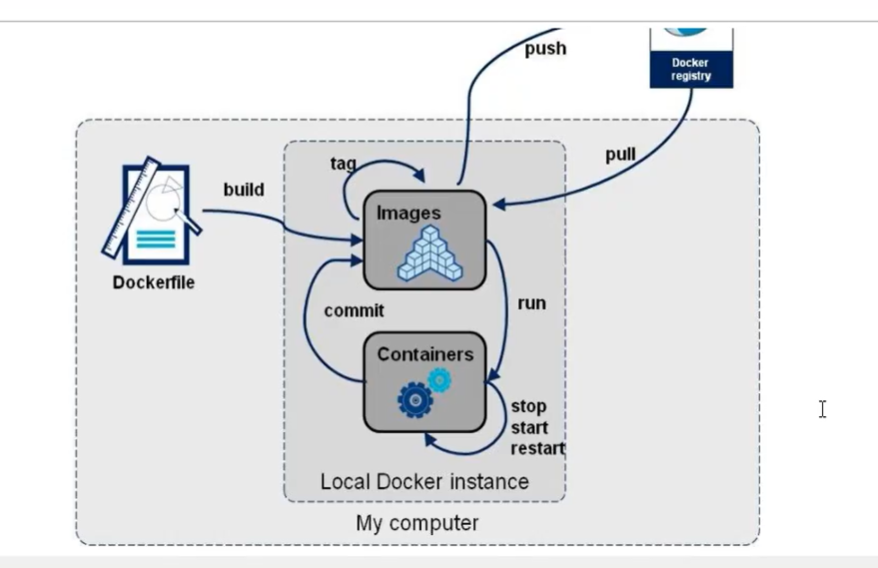
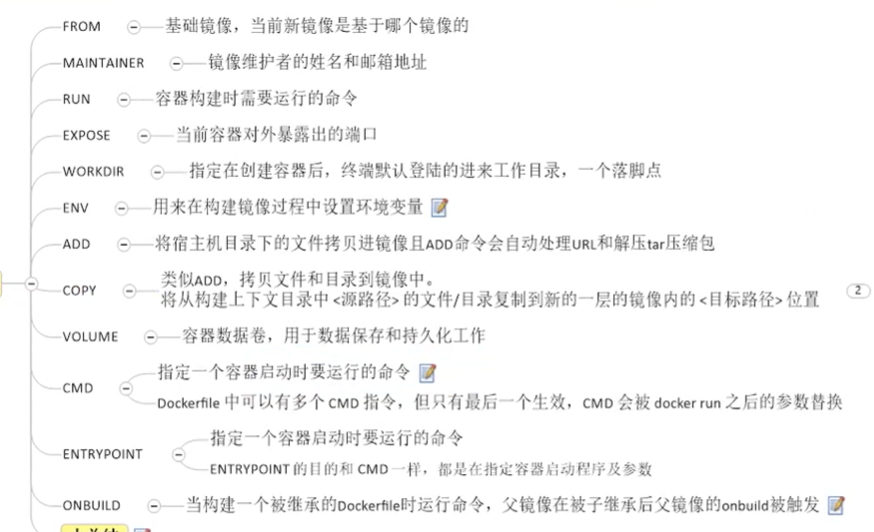

# 	阿里云开发者 课程中心

https://developer.aliyun.com/course/explore

> 包含初级中级高级的在线课程，涵盖云计算、大数据、数据库、开发语言等，也有阿里云自带的云管理课程等。

## Docker入门

https://developer.aliyun.com/course/1940

### 背景

面向运维，解决开发代码部署预期之外。核心就是**环境和配置**

“带鱼缸的金鱼”，带环境的软件。集装箱式搬家。

镜像交付：运行代码外还要有运行环境，环境配置，运行依赖关系等等

当代的大流量，高并发和集群部署的背景

### 理念

由下及上的整体打包，一次编译，处处运行

构建，安装，运行，处处运行

举例，Ngnix，MySQL，redis，MongoDB 四个软件，每个软件打包一个个独立集装箱克隆。运维只要安装Docker，使用这个四个集装箱就可以运行代码

> 完整的应用容器化过程主要分为以下几个步骤。
>
> - 编写应用代码。
> - 创建一个 Dockerfile，其中包括当前应用的描述、依赖以及该如何运行这个应用。
> - 对该 Dockerfile 执行 docker image build 命令。
> - 等待 Docker 将应用程序构建到 Docker 镜像中。

### 作用

虚拟机与容器虚拟化

虚拟机模拟整套实际物理机器，暂用资源多，冗余步骤多，启动略慢。如下图

Linux 发展另外一种虚拟化Linux容器 Linux Containers 缩写LXC 。 对进程进行隔离，容器不需要整套系统，app与Libraries库一一绑定，不同app之间库不同工作空间。如下图：

容器技术，应用直接运行与宿主的内核，没有自己的内核，也不进行硬件模拟，相比较轻便。

各个容器件互相隔离，进程间不会相互影响，降低耦合度

### 开发自运维DevOps

1. 更快速的应用交付和部署
2. 更便捷的升级和扩缩容
3. 更简单的系统运维
4. 更高效的计算资源利用

### Docker三要素

1. 镜像 image - 只读模板，用来创建容器 - 麦当劳的菜单
2. 容器 container - 实例，可以启动开始停止删除，简易版的Linux环境和应用程序 - 买到的汉堡
3. 仓库 repository - 远程镜存放场所。仓库和仓库注册服务器registry 不同。仓库注册服务器存放多个仓库，每个仓库包含多个不同标签的仓库。分为公开仓库和私有仓库

安装：

Centos 7 64位，内核位3.1以上

Centos 6.5 64位以上版本，内核2.6.32以上

查看内核

~~~bash
uname -r
4.9.0-4-amd64
~~~

查看Centos 版本

~~~bash
lsb_release -a
or
cat /etc/**release**
~~~

官方安装手册

https://docs.docker.com/engine/install/

### 镜像加速

1. 阿里云

   https://cr.console.aliyun.com/cn-hangzhou/instances/repositories

   ~~~bash
   # centos 6
   nano /etc/sysconfig/docker
   other_args = "--registry-mirror = https://*****.mirror.aliyuncs.com"
   
   service docker restart
   #检查是否生效
   ps -ef|grep docker
   ~~~

   

   ~~~bash
   #centos 7
   nano /etc/docker/deamon.json
       {
         "registry-mirrors": ["https://*******.mirror.aliyuncs.com"]
       }
   
   sudo systemctl daemon-reload
   sudo systemctl restart docker
   ~~~

2. 网易云

   ~~~bash
   #centos 7
   nano /etc/docker/deamon.json
       {
         "registry-mirrors": ["https://hub-mirror.c.163.com"]
       }
   ~~~
   
3. 验证

   ~~~bash
   ps  -ef|grep docker
   
   ~~~

   

### Hello World

~~~bash
docker run hello-world
# 首先在本地查找镜像
# 拉取远程仓库镜像
# 运行容器
~~~

### 底层原理

1. CS结构，守护进程运行在主机上
2. docker比VM更少的抽象层，不需要Hypervisor实现硬件资源虚拟化，直接云想在物理机硬件资源
3. docker使用宿主机内核，不需要虚拟机系统

### 常用命令

1. 帮助命令

   ~~~bash
   docker version
   #版本信息
   docker info
   #详细信息，比version更全面
   docker --help
   #帮助手册
   ~~~

2. 镜像镜像命令

   ~~~bash
   docker images
   # 列出【本地】镜像
   
   docker images -q
   # 显示images ID, bf756fb1ae65
   docker images -q redis
   
   docker images -a
   # 列出本地所有，包含中间镜像层，镜像千层饼理解
   
   docker images --digests
   # 显示摘要信息 sha256
   
   docker images --no-trunc
    # 显示完整信息
    
    docker images --filter dangling=true
    # 列出tag为<none>的镜像，dangling悬挂
    docker images -f since=mongo
    docker images -f before=ubuntu
    
   docker image ls --format "table {{.ID}}\t{{.Repository}}\t{{.Tag}}"
   # 显示选定的列
   docker images --format "table {{.ID}}\t{{.Repository}}\t{{.Tag}}"
   IMAGE ID            REPOSITORY          TAG
   5f515359c7f8        redis               latest
   05a60462f8ba        nginx               latest
   
   ~~~

   ~~~bash
   docker search xxx
    # 查找xxx镜像
   
   docker search -s 50 xxx
   # 大于50 星的
   
   docker search --no-trunc xxx
   # 不省略说明
   
   docker search --filter=is-automated=true xxx
   # 只列出automated build的镜像
   ~~~

   ~~~bash
   docker pull xxx
   # 下载
   ~~~

   ~~~bash
   docker rmi xxx
   # 删除某个ID镜像或唯一镜像名
      
   docker rmi -f xxx
   # 删除单个
      
   docker rmi -f 镜像名1:TAG 镜像名2:TAG
   # 删除多个 空格分隔
      
   docker rmi -f $(docker images -qa)
   # 删除本地全部 ，$后面是子命令
   ~~~

   > 类似Git 命令，有pull也会有类似的commit push

3. 容器操作命令

   ~~~bash
   docker pull centos
   # 大小约215MB
   
   
   docker run [option] IMAGE [command] [arg...]
   # option:
   ## --name ='' 指定名称
   ## -i 交互式运行
   ## -t 为容器分配一个虚拟输入终端
   ## -d 后台运行
   ## -P 随机映射端口
   ## -p 指定映射端口（hostPort:containerPort）
   docker run -it  --name='2020centos' centos
   [root@c1f11e5b39e6 /]# uname -a
   
   
   docker ps
   # 列出【正在运行】的container
   docker ps -a
   # 列出包括历史运行的容器
   docker ps -l
   # 上一个运行的
   docker ps -n 3
   # 上三次运行的
   docker ps -q
   # 静默模式，只显示编号
   docker ps--no-trunc
   # 不截断输出
   
   
   exit  
   # 退出并停止容器
   Ctrl+P+Q
   # 退出，不停止容器
   docker stop
   # 停止容器
   
   docker start ID
   # 启动容器
   
   docker restart ID(name 也可以)
   # 重启容器
   
   docker stop
   # 软性停止，等待关机
   docker kill 
   # 强制停止，立马关机
   
   docker rm
   # 删除已停止的容器，rmi是删除镜像，-f强制运行的容器
   docker rm -f $(docker ps -aq)
   docker ps -a -q | xargs docker rm
   # 批量删除所有容器 xargs 可变参数， |管道传递
   ~~~

   ~~~bash
   docker run -d IMAGE
   # 守护进程启动容器,在ps中显示退出
   ## 容器的后台运行，必须有有一个前台进程。设计原理
   ## 将需要运行的程序，以前台的进程的方式进行
   ## docker run --rm 运行完删除容器
   
   docker logs -f -t --tail n 容器ID
   # 查看容器日志
   ## -t 是显示时间戳 -f动态追加输出   --tail n 最后n条
   docker run -d centos /bin/sh -c "while true;do echo hello;sleep 2;done"
   
   docker top 容器ID
   # 查看容器内的进程，容器内的top
   ## 类似docker exec 容器ID top,而且还不用进入
   
   docker inspect 容器ID
   # 查看容器细节，jaon文件
   
   
   docker attach 容器ID
   docker exec -it 容器ID ls -l /tmp
   #进入【运行中】的容器，交互式
   ## attach 直接进入容器启动命令终端，不会启动新的进程【进入后操作】
   ## exec 在容器中打开新的终端 直接操作命令行，并且可以启动新的进程，在宿主机就对进行进行操作获得结果
   ## docker exec -it 容器ID /bin/bash 等同于 docker attach 容器ID
   
   docker cp 容器ID:容器路径 主机文件夹
   docker cp 231d5331e8ea:/tmp/ks-script-xm1o5azb /root
   #拷贝容器内文件到主机
   docker cp anaconda-ks.cfg 231d5331e8ea:/tmp
   #拷贝主机内文件到容器 也可以
   ~~~

### 镜像

> tomact 为什么比centos还大？
>
> 花卷层结构，鸡蛋同心结构

轻量级可执行的独立软件包，打包了运行环境和基于运行环境的软件。

包括：代码 运行时 库 环境的变量 和 配置文件

#### 联合文件系统 UnionFS

分层轻量级 高性能的文件系统，支持一层层的叠加。UnionFS是Docker镜像的基础。

#### 镜像加载原理

docker镜像由一层一层的文件系统组成。

bootfs 主要包含 bootloader 和kernel，最底层是bootfs

rootfs 在bootfs之上，包含/dev /proc /bin /etc /tmp等标准目录和文件，rootfs就是各种不同的发型版本，centos ubuntu等

不同发型版本的bootf是一样的，直接用宿主机的。rootfs才会有差别，这才镜像的内容，所以体积小。

tomcat 运行需要 1.kernel(用宿主机的) 2.centos或者Debian 3.JDK8 4.tomcat 所以比centos还大

分层结构有点，共享资源。解耦。很多镜像都是基于base，其他镜像可以共享使用。

用镜像生成容器时，只是在镜像的顶部加了一个可写层，这一层也叫容器层。镜像部分还是只读。

#### 镜像的commit

~~~bash
docker commit
# 提交容器副本，成为一个新的镜像，自定义镜像 定制镜像
# 在原有镜像的基础上，再叠加上容器的存储层，并构成新的镜像
docker commit -m="提交信息" -a="作者" 容器ID 新的镜像名:[标签]

docker commit -a='xiaojia' -m='without Docs' 5c0f079917dc xiaojia/tomcat:0.02
# 由容器得到镜像

[root@localhost ~]# docker exec -it webserver bash
root@8c5db1198f84:/# echo '<h1>Hello, Docker!</h1>' > /usr/share/nginx/html/index.html
root@8c5db1198f84:/# read escape sequence
[root@localhost ~]# docker diff webserver

docker commit \
    --author "xiaojia <xiaojia@gmail.com>" \
    --message "修改了默认网页" \
    webserver \
    nginx:v2
    
docker history nginx:v2
# 查看历史关系

## docker commit 意味着所有对镜像的操作都是黑箱操作
~~~

### 容器数据卷- Volume

> 保存、持久化容器产生的数据，保存进硬盘。可以比喻成活动移动硬盘
>
> 容器间（或宿主机）继承或可以共享数据

~~~bash
docker cp 
# 双向拷贝命令
~~~

#### 在容器内添加数据卷方式

1. ##### 直接命令添加

   ~~~bash
   docker run -it -v /宿主机绝对路径目录:/容器内目录 镜像名
   docker run -it -v /myDateVolume:/dateVC centos
   
   docker inspect 容器ID
   "HostConfig": {
               "Binds": [
                   "/myDateVolume:/dateVC"
               ],
   ~~~

   容器关闭后，宿主新建文件，容器开机后，也会同步。

   ~~~bash
   ro
   docker run -it -v /myDateVolume:/dateVC:ro centos
   # 容器内的文件只读，不能创建修改文件
   # touch: cannot touch 'j.txt': Read-only file system
   
   "HostConfig": {
               "Binds": [
                   "/myDateVolume:/dateVC:ro"
               ],
   
   "Mounts": [
               {
                   "Type": "bind",
                   "Source": "/myDateVolume",
                   "Destination": "/dateVC",
                   "Mode": "ro",
                   "RW": false,
                   "Propagation": "rprivate"
               }
   
   ~~~

   komavedio

   ~~~bash
   docker volume create --name v_webdb_data
   # 创建一个叫v_webdb_data的卷
   docker volume ls
   # 列出所有卷名
   docker volume inspect v_webdb_data
   # 查看卷的信息
   ## {
           "CreatedAt": "2020-12-23T19:10:16+08:00",
           "Driver": "local",
           "Labels": {},
           "Mountpoint": "/var/lib/docker/volumes/v_webdb_data/_data",
           "Name": "v_webdb_data",
           "Options": {},
           "Scope": "local"
       }
   ##
   docker run  -it --name webdb -v v_webdb_data:/var/lib/postgresql/data -p 5432:5432 -e POSTGRES_USER=dbuser -e POSTGRES_PASSWORD=12345678 -d postgres:9.6.20-alpine
   
   psql -h 127.0.0.1 -U dbuser
   
   docker inspect webdb
   # 查看容器参数
   "Mounts": [
               {
                   "Type": "volume",
                   "Name": "v_webdb_data",
                   "Source": "/var/lib/docker/volumes/v_webdb_data/_data",
                   "Destination": "/var/lib/postgresql/data",
                   "Driver": "local",
                   "Mode": "z",
                   "RW": true,
                   "Propagation": ""
               }
   
   ~~~

   

2. ##### DockerFile添加容器卷

   > 镜像的源码级别描述文件
   
   DockerFile里定义
   
   ~~~bash
   VOLUME["dataVolumeContainer","dataVolumeContainer2","dataVolumeContainer3"]
   # 只支持容器内，因为不是所有宿主机有指定文件夹，只能先在镜像里先创建指定文件夹
   ~~~
   
   DockerFile文件
   
   ~~~bash
   #volume test
   FROM centos
   VOLUME ["/dataVolumeContainer1","/dataVolumeContainer2"]
   CMD echo "finished,----sucess!"
   CMD /bin/bash
   ~~~
   
   
   
   ~~~bash
   docker build -f /path/Dockerfile -t xiaojia/centos .
   # 根据Dockerfile创建镜像
   # -f 给定Dockerfile 路径，如果在同目录，可以不加此参数
   # -t 指定名字
   # 不要忘记最后一个句号	
   
   [root@localhost mydocker]# docker build -t xiaojia/centos-volume .
   Sending build context to Docker daemon  2.048kB
   Step 1/4 : FROM centos
    ---> 0d120b6ccaa8
   Step 2/4 : VOLUME ["/dataVolumeContainer1","/dataVolumeContainer2"]
    ---> Running in 5a1378198810
   Removing intermediate container 5a1378198810
    ---> c4ff28e86c95
   Step 3/4 : CMD echo "finished,----sucess!"
    ---> Running in d816350a0ca6
   Removing intermediate container d816350a0ca6
    ---> 9d1b1ee1464e
   Step 4/4 : CMD /bin/bash
    ---> Running in a994defd7352
   Removing intermediate container a994defd7352
    ---> f7e8c44bd8ef
   Successfully built f7e8c44bd8ef
   Successfully tagged xiaojia/centos-volume:latest
   ~~~
   
   ~~~bash
   docker inspect
   "Volumes": {
                   "/dataVolumeContainer1": {},
                   "/dataVolumeContainer2": {}
               },
   
   宿主机对应地址
   /var/lib/docker/volumes/
   /var/lib/docker/volumes/34d3edd2bf1c7364ebb48937f935c6dd9db96628350f0f5079615afbdfc5bb53/_data
   ~~~
   
   > docker 挂在主机目录出现写入权限禁止时，在挂在目录加如下参数
   
   ~~~bash
   --privileged = true
   docker run -it -v /myDateVolume:/dateVC:ro centos --privileged = true
   #:ro 代表只读
   ~~~

#### 数据卷容器 -v

>活动硬盘上挂在活动硬盘，实现容器间资源传递和共享
>
>--volumes-from dc01
>
>就是一个文件夹，用户离开，文件不会丢失

### DockerFile 解析

手动编写步骤过程

* 手动编写符合规范的DockerFile文件
* docker build 生成自定义镜像
* docker run 运行生成容器

> DockerFile类似shell脚本，一些列命令和参数构成的脚本

#### centos 7 的DockerFile：

~~~bash
FROM scratch
# scratch 元镜像
ADD centos-7-x86_64-docker.tar.xz /

LABEL \
    org.label-schema.schema-version="1.0" \
    org.label-schema.name="CentOS Base Image" \
    org.label-schema.vendor="CentOS" \
    org.label-schema.license="GPLv2" \
    org.label-schema.build-date="20201113" \
    org.opencontainers.image.title="CentOS Base Image" \
    org.opencontainers.image.vendor="CentOS" \
    org.opencontainers.image.licenses="GPL-2.0-only" \
    org.opencontainers.image.created="2020-11-13 00:00:00+00:00"

CMD ["/bin/bash"]
# docker run -it 的时候，最后要不要加/bin/bash
~~~

#### 解析过程

1. 每条保留指令，必须为大写，且后面至少有一个参数
2. 从上到下执行
3. #表示注释
4. 每条指定创建新的镜像层，并对镜像进行提交

执行流程：

1. 从基础镜像运行一个临时容器 

   #FROM scratch

2. 执行每条指令，并对容器修改

3. 执行类似docker commit 提交每一层的镜像层

4. 最外层提交镜像，运行新容器

5. 执行DockerFile 的下一条命令，直至结束

DockerFile Docker镜像 Docker 容器三者关系：

1. DockerFile - 菜谱(厨师记忆里拥有的) - 面向开发
2. Docker镜像  - 菜单(餐厅桌子上看到的) - 交付标准
3. Docker容器 - 菜肴(顾客真正吃的到的) - 涉及部署和运维

~~~bash
FROM debian:stretch

RUN set -x; buildDeps='gcc libc6-dev make wget' \
    && apt-get update \
    && apt-get install -y $buildDeps \
    && wget -O redis.tar.gz "http://download.redis.io/releases/redis-5.0.3.tar.gz" \
    && mkdir -p /usr/src/redis \
    && tar -xzf redis.tar.gz -C /usr/src/redis --strip-components=1 \
    && make -C /usr/src/redis \
    && make -C /usr/src/redis install \
    && rm -rf /var/lib/apt/lists/* \
    && rm redis.tar.gz \
    && rm -r /usr/src/redis \
    && apt-get purge -y --auto-remove $buildDeps
~~~

#### 保留关键字指令

~~~bash
FROM
# 基础镜像，base哪个镜像
# FROM scratch

MAINTAINER
# 镜像作者的姓名和邮箱地址
# MAINTAINER https://github.com/CentOS/sig-cloud-instance-images

RUN
# 容器构建需要运行的额外命令
# RUN groupadd -r -g 999 redis && useradd -r -g redis -u 999 redis
# 添加一个用户组合用户
# apt-get install -y --no-install-recommends

##RUN 有两种写法
# shell 格式
# RUN echo '<h1>Hello, Docker!</h1>' > /usr/share/nginx/html/index.html
# exec 格式 : RUN ["可执行文件", "参数1", "参数2"]
# 

EXPOSE
# 端口暴露
# EXPOSE 6379

WORKDIR
# 创建容器后，默认终端的工作目录，落脚点。进入容器后pwd看到的
# WORKDIR /data

ENV
# 在创建镜像过程中的定义些环境变量，后续可以直接调用环境变量前缀
# ENV MY_PATH /tmp
# 后面可以直接使用 WORKDIR $MY_PATH

ADD
# 拷贝一个文件，自解压缩tar包
# ADD centos-8-x86_64.tar.xz /
COPY
# 拷贝一个文件，不解压缩
# COPY src dest
# COPY ['src','dest']

## 所有的文件复制均使用 COPY 指令，仅在需要自动解压缩的场合使用 ADD。

VOLUME
# 容器数据卷，保存数据和持久化

CMD
# 运行容器时，指定运行命令
# 可以有多个CMD命令，但是只有最后一个生效
# CMD 会被docker run之后的参数替换。比如，run的时候运行cd /tmp
ENTRYPOINT
# 运行容器时，指定运行命令
# 此处定义的命令，会追加到docker run之后，不会被代替

ONBUILD
# 触发器。如果此镜像可以被继承，父镜像被继承时，父镜像会出发ONBUILD
~~~

#### FROM

~~~BASH
FROM scratch
~~~

99%的镜像都是通过base镜像中，构建和配置产生的。

##### 自定义一个centos镜像

1. 修改落脚点文件夹
2. vim ifconfig软件添加

##### 编写DockerFile

~~~bash
FROM centos
MAINTAINER xiaojia(null@null.com)

ENV MYPATH /usr/local
WORKDIR $MYPATH

RUN yum -y install epel-release
# 顺序重要，不然后面htop安装不了
RUN yum -y install nano
RUN yum -y install htop
RUN yum -y install net-tools

EXPOSE 80

CMD echo $MYPATH
CMD echo "Success..."

CMD ["/bin/bash"]
~~~

~~~bash
docker build -t xiaojia-centos:1.0.1 .
# 共计12步命令需要执行
~~~

~~~bash
docker history 镜像ID
# 列出镜像变更历史

IMAGE               CREATED              CREATED BY                                      SIZE                COMMENT
c2b592968c95        About a minute ago   /bin/sh -c #(nop)  CMD ["/bin/bash"]            0B
7b1676ae51cb        About a minute ago   /bin/sh -c #(nop)  CMD ["/bin/sh" "-c" "echo…   0B
99ec0a0ee35b        About a minute ago   /bin/sh -c #(nop)  CMD ["/bin/sh" "-c" "echo…   0B
54a5dc447531        About a minute ago   /bin/sh -c #(nop)  EXPOSE 80                    0B
f6e47b7e4fa2        About a minute ago   /bin/sh -c yum -y install glances               55MB
4a0cebf2f281        52 minutes ago       /bin/sh -c yum -y install net-tools             31.6MB
dfb7b2e00654        53 minutes ago       /bin/sh -c yum -y install htop                  31.1MB
685710ed5684        53 minutes ago       /bin/sh -c yum -y install nano                  47.4MB
405a0b869ff2        54 minutes ago       /bin/sh -c yum -y install epel-release          31.5MB
49c58270b3a7        55 minutes ago       /bin/sh -c #(nop) WORKDIR /usr/local            0B
e41b25be6ada        55 minutes ago       /bin/sh -c #(nop)  ENV MYPATH=/usr/local        0B
99929d090d03        55 minutes ago       /bin/sh -c #(nop)  MAINTAINER xiaojia(null@n…   0B
0d120b6ccaa8        4 months ago         /bin/sh -c #(nop)  CMD ["/bin/bash"]            0B
<missing>           4 months ago         /bin/sh -c #(nop)  LABEL org.label-schema.sc…   0B
<missing>           4 months ago         /bin/sh -c #(nop) ADD file:538afc0c5c964ce0d…   215MB

~~~

#### ENTRYPOINT / CMD

> 指定容器启东市，需要运行的命令
>
> CMD 只有最后一个生效，会被docker run中的参数替换
>
> ENTRYPOINT 不会被替换，只会添加成新的命令组合

##### CMD

~~~bash
CMD ["catalina.sh", "run"]
# tomcat的最后一行
docker run -itP fc5d5f0e9acf /bin/bash
# 这样运行，tomcat就不会被启动了
~~~

~~~bash
FROM centos
RUN yum install -y curl
CMD ["curl","-s","http://whatismyip.akamai.com/"]
~~~

>CMD	里的参数或者命令
>
>1. 仅仅执行最后一个CMD
>
>2. 如果run 命令行里给了参数，会被覆盖
>
>   比如，镜像内是输出 node -v，如果run时候，给定命令是node -help，会运行-help而不是-v。又或者 -e "console.log('hello')"

##### ENTRYPOINT

~~~BASH
curl http://whatismyip.akamai.com/ -i
# 获取http报头，CMD容器执行时会报错
 docker run -it 63c0a7b87f7a -i
docker: Error response from daemon: OCI runtime create failed: container_linux.go:349: starting container process caused "exec: \"-i\": executable file not found in $PATH": unknown.

~~~

~~~BASH
FROM centos
RUN yum install -y curl
ENTRYPOINT ["curl","-s","http://whatismyip.akamai.com/"]
~~~

~~~bash
docker build -f Dockerfile03 -t myip .
docker run -it 317568489eb9 -i
~~~

#### ONBUILD

> 被继承的父镜像，被子镜像继承时，触发的父镜像命令

~~~bash
FROM centos
RUN yum install -y curl
ENTRYPOINT ["curl","-s","http://whatismyip.akamai.com/"]
ONBUILD RUN echo "Father images was inherited."
~~~

~~~bash
# docker build -f Dockerfile04 -t father_ip .
Sending build context to Docker daemon  4.096kB
Step 1/4 : FROM centos
 ---> 0d120b6ccaa8
Step 2/4 : RUN yum install -y curl
 ---> Using cache
 ---> 5a0f8bfdedc6
Step 3/4 : ENTRYPOINT ["curl","-s","http://whatismyip.akamai.com/"]
 ---> Using cache
 ---> 317568489eb9
Step 4/4 : ONBUILD RUN echo "Father images was inherited."
 ---> Running in 383803a290e3
Removing intermediate container 383803a290e3
 ---> 6452e6c6f97c
Successfully built 6452e6c6f97c
Successfully tagged father_ip:latest
~~~

添加一个FROM father_ip的DockerFile

~~~bash
FROM father_ip
RUN yum install -y curl
CMD ["curl","-s","http://whatismyip.akamai.com/"]
ENTRYPOINT ["curl","-s","http://whatismyip.akamai.com/"]
~~~

~~~bash
docker build -f Dockerfile05 -t son_ip .
Sending build context to Docker daemon   5.12kB
Step 1/4 : FROM father_ip
# Executing 1 build trigger
 ---> Running in a9807632f2b8
Father images was inherited.
## 出现在此处
Removing intermediate container a9807632f2b8
 ---> 9831a17c6c06
Step 2/4 : RUN yum install -y curl
 ---> Running in 3915df17d562
Last metadata expiration check: 1:32:25 ago on Thu Dec 10 01:31:01 2020.
Package curl-7.61.1-14.el8.x86_64 is already installed.
Dependencies resolved.
Nothing to do.
Complete!
Removing intermediate container 3915df17d562
 ---> 1fbc3efed9f4
Step 3/4 : CMD ["curl","-s","http://whatismyip.akamai.com/"]
 ---> Running in 12279aa2db5c
Removing intermediate container 12279aa2db5c
 ---> 10888c07f207
Step 4/4 : ENTRYPOINT ["curl","-s","http://whatismyip.akamai.com/"]
 ---> Running in 9e50a39e59b0
Removing intermediate container 9e50a39e59b0
 ---> 3ad2552285f8
Successfully built 3ad2552285f8
Successfully tagged son_ip:latest

~~~

#### ADD / COPY

> ADD 将宿主机指定文件拷贝到镜像，自动处理URL和解压tar包
>
> COPY 拷贝文进镜像，不解压缩

~~~bash
touch c.txt
# 为了演示ADD / COPY
~~~

自义定一个tomcat

~~~bash
FROM centos
MAINTAINER xiaojia

COPY c.txt /usr/local/cincontainer.txt

ADD apache-tomcat-9.0.41.tar.gz /usr/local
ADD jdk-8u171-linux-x64.tar.gz /usr/local

RUN yum install -y nano

ENV MYPATH /usr/local
WORKDIR $MYPATH

ENV JAVA_HOME /usr/local/jdk1.8.0_171
ENV CLASSPATH $JAVA_HOME/lib/dt.jar:$JAVA_HOME/lib/tools.jar

ENV CATALINA_HOME /usr/local/apache-tomcat-9.0.41
ENV CATALINA_BASE /usr/local/apache-tomcat-9.0.41

ENV PATH $PATH:$JAVA_HOME/bin:$CATALINA_HOME/bin

EXPOSE 8080

# ENTRYPOINT ["/usr/local/apache-tomcat-9.0.41/bin/startup.sh"]
# CMD ["/usr/local/apache-tomcat-9.0.41/bin/catalina.sh","run"]
CMD /usr/local/apache-tomcat-9.0.41/bin/startup.sh && tail -F /usr/local/apache-tomcat-9.0.41/bin/logs/catalina.out
~~~

~~~bash
docker build -f Dockerfile -t test_build_tomcat .
~~~

~~~bash
docker run -d -p 9080:8080 --name Build-Tomcat -v /root/Newtomcat/DockerFile/test:/usr/local/apache-tomcat-9.0.41/webapps/test -v /root/Newtomcat/DockerFile/tomcatlogs:/usr/local/apache-tomcat-9.0.41/logs --privileged=true test_build_tomcat
~~~

~~~bash
# Test 工程发布
~~~

/DockerFile/test/WEB-INF/web.xml

~~~xml
<?xml version ="1.0" endcoding ="UTF-8" ?>
<web-app xmlns:xsi="http://www.w3.org/2001/XMLSchema-instance"
 xmlns="http://java.sun.com/xml/nx/javaee"
 xsi:schemaLocation="http://java.sun.com/xml/ns/javaee http://java.sun.com/xml/ns/javaee/web-app_2_5.xsd"
 id="WebApp_ID version="2.5">

<display-name>test webapp</display-name>

</web-app>

~~~

/DockerFile/test/a.jsp

~~~java
<%@ page language="java" contentType="text/html;charset=UTF-8" pageEncoding="UTF-8" %>
<!DOCTYPE html PUBLIC "-//W3C//DTD HTML 4.01 Transition//EN" "http://www.w3.org/TR/html4/loose.dtd">
<html>
<head>
	<meta http-equiv="Content-Type" content="text/html;charset=UTF-8">
	<title>Test Webapp</title>
</head>
<body>
----welcome---
<%="I am in docker tomcat" %>
 
 
<% System.out.print("======Docker tomcat self");%>
<!--后台打印到log -->
</body>
</html>
~~~

~~~bash
docker exec 2f22e9007087 ls -l /usr/local/apache-tomcat-9.0.41/webapps/test
# 可以看到，由于Volume关联了，容器内也会有文件
~~~

> 教学视频中，提及以下事项
>
> 1. 网页正常运行
> 2. 修改a.jsp文件，网站也会同步更新
> 3. 多次访问后，catalina.out 也会记录脚本留给log的日志

#### DockerFile总结

### Docker 常用安装

> tomcat / mysql / redis

#### mysql

~~~bash
docker run -dp 13306:3306 --name mysql-test  -v /root/Dockers/mysql/conf:/etc/mysql/conf.d -v /root/Dockers/mysql/logs:/logs -v /root/Dockers/mysql/data:/var/lib/mysql -e MYSQL_ROOT_PASSWORD=123456 mysql:5.6 
~~~

~~~mysql
# 创建测试数据
create database db01;
use db01;
create table t_book(id int not null primary key,bookName varchar(20));
insert into t_book value(1,'Docker');
select * from t_book;
+----+----------+
| id | bookName |
+----+----------+
|  1 | Docker   |
+----+----------+
1 row in set (0.00 sec)

~~~

~~~mysql
# Docker 外备份数据
docker exec fc97b066bbc6 sh -c 'exec mysqldump --all-databases -uroot -p"123456"' > /root/Dockers/mysql/backup.sql
# Warning: Using a password on the command line interface can be insecure.
# 密码写在命令行里不安全警告
~~~

#### Redis

~~~bash
docker pull redis
docker run -dp 16379:6379 -v /root/Dockers/redis/data:/data -v /root/Dockers/redis/conf/redis.conf:/usr/local/etc/redis.conf redis redis-server /usr/local/etc/redis.conf --appendonly yes
# --appendonly yes 开启AOF持久化
~~~

~~~bash
docker exec -it 78c0c92805a6 redis-cli
127.0.0.1:6379> set k1 v1
tail -10 /root/Dockers/redis/data/appendonly.aof
~~~

### 本地镜像推送到阿里云

#### 镜像的生成方法

1. DockerFile 然后build

2. 从容器生成

   ~~~bash
   docker commit -m="提交信息" -a="作者" 容器ID 新的镜像名:[标签]
   ~~~

#### 推送到阿里云

1. 在阿里云后台添加镜像仓库和命名空间

2. 本地操作，登录到阿里云的Docker 仓库

   ~~~bash
   sudo docker login --username=s*n***8@qq.com registry.cn-shenzhen.aliyuncs.com
   
   sudo docker tag [ImageId] registry.cn-shenzhen.aliyuncs.com/sanhu88/tomcat-with-homepage:[镜像版本号]
   
   sudo docker push registry.cn-shenzhen.aliyuncs.com/sanhu88/tomcat-with-homepage:[镜像版本号]
   ~~~

3. 镜像中心搜索

   ~~~bash
   https://cr.console.aliyun.com/cn-shenzhen/instances/images
   # 搜索
   https://cr.console.aliyun.com/images/cn-shenzhen/sanhu88/tomcat-with-homepage/detail
   # 前台连接
   https://cr.console.aliyun.com/cn-shenzhen/instance/repositories
   # 管理仓库
   ~~~

### pgadmin4

~~~bash
docker run --name pgadmin4 -p 8086:80 -e 'PGADMIN_DEFAULT_EMAIL=xiaojia@dokcer.com' -e 'PGADMIN_DEFAULT_PASSWORD=12345678' -d dpage/pgadmin4:latest
~~~

### redis

~~~bash
docker volume  create --name v_reids_data
docker volume ls
# 创建专用数据卷
docker run --name redis01 -v v_reids_data:/data -p 16379:6379 -d redis:6.0.9-alpine redis-server --appendonly yes --requirepass 12345678
# 创建容器，镜像名后加上一些命令
nmap 127.0.0.1
netstat -nltp
docker top redis01
# 验证容器状态

yum install redis-tools
# 宿主机安装命令行工具
redis-cli -h 127.0.0.1 -p 16379 -a 12345678
~~~

### Docker Compose

> 组合使用，比如LAMP网站程序，打包完整解决方案。生产环境K8S，开发使用DC
>
> 1. 基于Python，甚至可以pip安装

https://docs.docker.com/compose/

https://github.com/docker/compose

https://github.com/docker/compose/releases/

安装docker compose

~~~bash
sudo curl -L "https://github.com/docker/compose/releases/download/1.27.4/docker-compose-$(uname -s)-$(uname -m)" -o /usr/local/bin/docker-compose

sudo chmod +x /usr/local/bin/docker-compose
# 增加可执行权限

docker-compose --version
# docker-compose version 1.27.4, build 40524192

rm /usr/local/bin/docker-compose
# 卸载 ，删除文件就完成
~~~

创建三个文件

1. mian.py

   ~~~python
   from flask import Flask
   
   app = Falsk(__name__)
   
   @app.route('/')
   
   def hello():
       return 'Hello From Flask!'
   
   
   if __name__ == "__main__":
       app.run(host="0.0.0.0", debug=True, port=5000)
   ~~~

2. requirements.txt

   ~~~bash
   flash==1.1.2
   # 不能有空格
   ~~~

3. Dockerfile

   ~~~bash
   FROM python:3.10.0a3-alpine3.12
   
   ADD . /app
   # 当前目录打包到容器的app目录下
   # ADD 将宿主机指定文件拷贝到镜像，自动处理URL和解压tar包
   WORKDIR /app
   # 安装python依赖包
   RUN pip install -r requirements.txt
   # 启动flask应用服务
   CMD python main.py
   ~~~

构建镜像

~~~bash
docker build -t xiaojia/koma_flask_python:0.1 .
~~~

运行镜像

~~~bash
docker run --name flaskserver -d -p 8085:5000 xiaojia/koma_flask_python:0.1
~~~

整理

~~~
docker container prune
docker image prune
~~~

#### docker-compose.yml

~~~yaml
version: '3.8'
# docker compose 版本和docker对应
services:
  myflaskweb:
    build: .
    ports:
    - "8085:5000"
    volumes:
    - .:/app
~~~

~~~bash
docker-compose up
# 编译后启动，不推荐，检测源文件变动
docker-compose up --build
# 每次运行前，都从新编译
docker-compose up -d --build
# 守护进程运行
docker-compose ps
# 查看状态
#        Name                    Command            State           Ports
# ---------------------------------------------------------------------------------
# compose_myflaskweb_1   /bin/sh -c python main.py   Up      0.0.0.0:8085->5000/tcp

docker-compose run myweb top
docker-compose top
# 查看容器输出日志

docker-compose logs -f myweb
docker logs -f work_myweb_1
# 查看容器输出日志

docker-compose stop
# 容器停止
docker-compose down
# 容器停止+消除(容器+网络)

docker-compose down --rmi all
# 容器停止+消除(容器+网络+镜像)
~~~

#### Flask+Redis

~~~bash
两个容器：
web 服务器 ：Flask
数据库 ： Redis
~~~

mian.py

~~~python
from flask import Flask
from redis import Redis

app = Flask(__name__)
redis = Redis(host='myredis', port=6379)
# 因为redis的IP是docker分配，不知道具体IP。填写yml里的服务名
@app.route('/')
def hello():
    redis.incr('hits')
    # hits 加一
    return '你好! 我们见过 %s 次面。' % redis.get('hits')

if __name__ == "__main__":
    app.run(host="0.0.0.0", debug=True, port=5000)
~~~

requirements.txt

~~~bash
flask==1.1.2
redis==3.5.3
~~~

Dockerfile

~~~bash
# 描述Web服务器
FROM python:3.10.0a3-alpine3.12

ADD . /app
WORKDIR /app
RUN pip install -r requirements.txt
CMD python main.py
~~~

docker-compose.yml

~~~yaml
version:'3.8'
services:
 myweb:
  build: .
  # 本地镜像构建，也就是DockerFile生成的
  ports:
  - "8088:5000"
  volumes:
  - .:/app
  depends_on:
  - myredis
 myredis:
  image:redis:6.0.9-alpine
~~~

~~~bash
netstat -nltp
# 查看主机端口
~~~

#### Vue 开发环境

> node.js的docker镜像使用
>
> 安装 Vue Cli4
>
> 过程：下载官网镜像，安装各种所需工具，然后打包

~~~bash
sudo docker pull node:12.18.1-buster
mkdir src
~~~

Dockerfile

~~~
FROM node:12.18.1-buster
ADD ./src /app
WORKDIR /app
ENV DEBCONF_NOWARNINGS yes
RUN apt-get update -y && \
    apt-get upgrade -y && \
    apt-get install -y \
        build-essential -y \
        curl \
        nmap \
        git \
        nano \
    && rm -rf /var/lib/apt/lists/*
RUN npm install -g @vue/cli@4.4.6
~~~

打包,运行测试

~~~bash
docker build -t xiaojia/komavuecli4:1.0 .

docker run -it --name komavue -v /root/koma/Vue/src:/app -p 8082:8080 -d xiaojia/komavuecli4:1.0
~~~

进入容器进行配置

~~~bash
docker exec -it komavue /bin/bash

root@0787168b0f7b:/app# vue -V
@vue/cli 4.4.6

 nano ~/.bashrc
 # 修改添加命令别名
 ...
export LS_OPTIONS='--color=auto'
alias ls='ls $LS_OPTIONS'
alias ll='ls $LS_OPTIONS -l'
alias l='ls $LS_OPTIONS -lA'
...
exit容器后，重新exec后生效

nano ~/.vuerc
# 修改vue 默认设置
...
{
  "useTaobaoRegistry": false,
  "packageManager": "npm"
}
...
~~~

容器内创建Vue工程

~~~bash
vue create myvueweb
cd myvueweb
npm run serve
~~~

#### MySQL

~~~bash
docker pull mysql:5.7.33
# 拉取
docker run -it --name komasql -e MYSQL_ROOT_PASSWORD=123456 -d mysql:5.7.33
# 运行
docker exec -it komasql bash -p
# 进入容器
mysql -u root -p -h 127.0.0.1
show databases;
docker stop komasql
# 关闭，准备使用docker-compose配置

mkdir initdb
# 初始化脚本目录
mkdir datadir
# 数据库存放目录
~~~

~~~yaml

version: '3.8'
services:
 mysql:
  build: ./mysql/
  # 本地镜像构建，也就是DockerFile生成的
  ports:
  - "3306:3306"
  volumes:
  - ./mysql/initdb:/docker-entrypoint-initdb.d
  - ./mysql/datadir:/var/lib/mysql
  image: komapp
  environment:
  - MYSQL_ROOT_PASSWORD=123456

~~~

mysql/initdb/init.sql

~~~sql
create database blogdb;
create table blogdb.user(id int,name varchar(255));
insert into blogdb.user values(1,"koma");
insert into blogdb.user values(2,"xiaoma");
insert into blogdb.user values(3,"xiaojia");
~~~

mysql/Dockerfile

~~~yaml
FROM mysql:5.7.33
EXPOSE 3306
ADD ./my.cnf /etc/mysql/conf.d/my/cnf
CMD ["mysqld"]
~~~

mysql/my.cnf

~~~bash
[mysqld]
character-set-server=utf8

[mysql]
default-character-set=utf8

[client]
default-character-set=utf8
~~~

compose构建镜像

~~~bash
docker-compose build

docker-compose up -d

~~~

编写node组件和脚本

~~~bash
npm init -y
# 初始化一个工程
npm install mysql --save
# 安装mysql扩展
nano main.js
~~~

~~~js
const mysql = require('mysql');
const connection = mysql.createConnection({
        host:'localhost',
        user:'root',
        password:'123456',
        database:'blogdb'
});
connection.connect((err)=>{
        if (err){
                console.log('error connecting : '+err.stack);
                return;
        }
        connection.query(
                'SELECT * FROM user',(error,results)=>{
                        console.log(results);
                }
        );
});

~~~

~~~bash
node main.js

[
  RowDataPacket { id: 1, name: 'koma' },
  RowDataPacket { id: 2, name: 'xiaoma' },
  RowDataPacket { id: 3, name: 'xiaojia' }
]

~~~

> host 中IP，如果node是容器，要在一个bridge里，才能访问[]