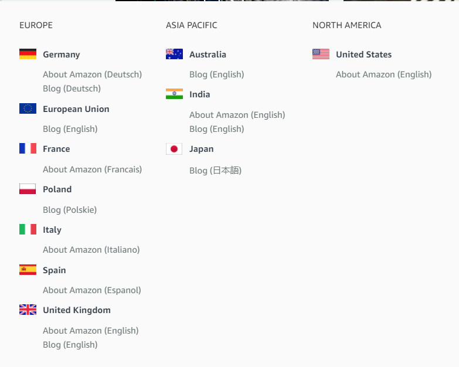

# AboutAmazon

 https://www.aboutamazon.com/

> 来自 https://www.amazon.com/dogsofamazon 介绍亚马逊404页面狗狗的介绍，找到了“关于亚马逊”的网站

有很多英文站点，也是学习英文和了解世界的窗口。

中文翻译主要参考有道词典和[deepL](https://www.deepl.com/translator)。

## [亚马逊住房基金项目](https://www.aboutamazon.com/news/community/amazon-launches-2-billion-housing-equity-fund-to-preserve-and-create-over-20-000-affordable-homes)

~~~
Housing fund to benefit moderate- to low-income families and individuals（个人） in three communities Amazon calls home: Washington State’s Puget Sound region; Arlington, Virginia; and Nashville, Tennessee.
~~~

> 住房基金将惠及亚马逊称之为家的三个社区的中低收入家庭和个人:华盛顿州的普吉特湾地区;弗吉尼亚州的阿灵顿;田纳西州的纳什维尔。